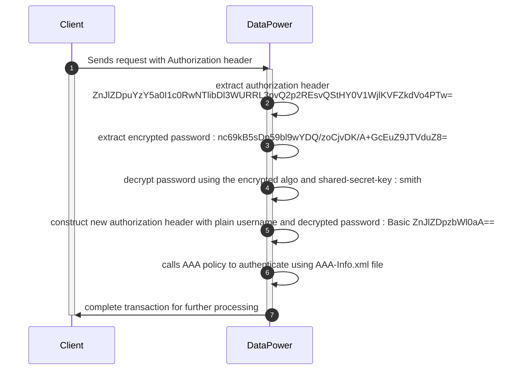

Hello Tech Enthusiasts 👋,

AAA is something DataPower is offerring from a day of appliance available in marked. So it's not a new topic of discussion. However, as a authentication mechanism, which is basic-auth, aaa-info file is widely used. I usually don't support as the creds are visible whomesover has access to domain/environment. 

There are other mechanism which can be helpful, but in this article I'm purely focussing on easy solution. The easiest option is using encrypt/decrypt mechanism which to be used for credentials. Here you go with the design and sequence diagram to understand the process.

**Admin Process**

{: width="600" height="400" }
_Adminstrator Steps_

1. Admin post plain credentials credential by using encrypt/decrypt service in DataPower.
2. DataPower returns encrypted text to admin.
3. Admin shared the plain username and encrypted password with client via secure line.
4. Admin to update the aaa-info.xml file with plain username and password.

Below postman screenshot depicts the behavior of service

{: .dark }
{: .light }
_Encrypt Password String_

{: .light}
{: .dark}
_Validate Encrypted Password_

**Sequence Diagram**

> Enable light theme for better visibilty
{: .prompt-tip }

Please do comment down your views.

— Keep Learning 😊

— Aditya Singh

>_If this article helped you in someway and want to support me, you can_ ... {:target="_blank"}
